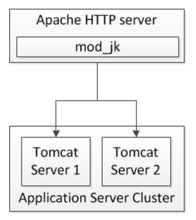

## Mod_Jk:
mod_jk is an Apache HTTP Server module used to connect Apache to Tomcat, enabling Apache to serve dynamic content generated by Java web applications deployed on Tomcat. It facilitates communication between Apache and Tomcat via the AJP (Apache JServ Protocol) or the newer HTTP protocols.

- Load balancing: mod_jk supports load balancing requests across multiple backend Tomcat servers, distributing the workload efficiently.
- Failover: It provides failover capabilities, allowing requests to be rerouted to alternative Tomcat instances in case of server failures.





### Step-1: Make sure the apache services are running:

```
yum install httpd -y
apachectl status
apachectl start

apachectl configtest
```


### Step-2: Install Dependencies:

```
yum install httpd-devel -y
yum install gcc gcc-c++ make autoconf libtool -y 
```


### Step-3: Download mod_jk connector (tar.gz format) from tomcat website:

"https://tomcat.apache.org/download-connectors.cgi"


```
wget https://dlcdn.apache.org/tomcat/tomcat-connectors/jk/tomcat-connectors-1.2.49-src.tar.gz

tar -xvf tomcat-connectors-1.2.49-src.tar.gz
```


### Step-4:  Configure with APXS:

```
cd tomcat-connectors-1.2.49-src/native/

./configure -with-apxs=/usr/bin/apxs


make
make install
```

```
which apxs  
find / -name "apxs"
	/usr/bin/apxs
```


Note: Now you should be able to see the apache2.0 directory created under the native directory, "mod_jk.so" file copy it to modules directory of your apache web server:

```
ll apache-2.0/

-rw-r--r-- 1 root bin   11K Sep  7  2023 bldjk54.qclsrc
-rw-r--r-- 1 root bin  9.4K Sep  7  2023 bldjk.qclsrc
-rw-r--r-- 1 root bin  1.4K Sep  7  2023 config.m4
-rw-r--r-- 1 root bin    96 Sep  7  2023 .gitignore
drwxr-xr-x 2 root root   90 Apr 15 21:00 .libs
-rw-r--r-- 1 root root 3.4K Apr 15 20:59 Makefile
-rw-r--r-- 1 root root 1.7K Apr 15 20:59 Makefile.apxs
-rw-r--r-- 1 root bin  1.5K Sep  7  2023 Makefile.apxs.in
-rw-r--r-- 1 root bin  3.1K Sep  7  2023 Makefile.in
-rw-r--r-- 1 root bin  3.7K Sep  7  2023 Makefile.vc
-rw-r--r-- 1 root root 2.9M Apr 15 21:00 mod_jk.a
-rw-r--r-- 1 root bin  145K Sep  7  2023 mod_jk.c
-rw-r--r-- 1 root root  920 Apr 15 21:00 mod_jk.la
-rw-r--r-- 1 root root  270 Apr 15 21:00 mod_jk.lo
-rw-r--r-- 1 root root 400K Apr 15 21:00 mod_jk.o
-rwxr-xr-x 1 root root 1.5M Apr 15 21:00 mod_jk.so
```


```
cp apache-2.0/mod_jk.so /etc/httpd/modules/
```


```
ll /etc/httpd/

drwxr-xr-x   2 root root   37 Apr 15 20:50 conf
drwxr-xr-x   2 root root   82 Apr 15 20:50 conf.d
drwxr-xr-x   2 root root  146 Apr 15 20:50 conf.modules.d
lrwxrwxrwx   1 root root   19 Apr 15 20:50 logs -> ../../var/log/httpd
lrwxrwxrwx   1 root root   29 Apr 15 20:50 modules -> ../../usr/lib64/httpd/modules
lrwxrwxrwx   1 root root   10 Apr 15 20:50 run -> /run/httpd
```


```
ll /etc/httpd/modules/
```


### Step-5: Creating workers.properties file:

We have defined the JkWorkersFile file name and location on the inside the mod_jk.conf file.

Here 8009 is the AJP port number on the backend Tomcat Servers.


```
vim /etc/httpd/conf/workers.properties


# Define list of workers:
#worker.list=jkstatus,node1,node2
worker.list=jkstatus,loadbalancer

# Status worker for managing load-balancer:
worker.jkstatus.type=status


# Here is you decide how many Tomcat Server's in the cluster:
worker.loadbalancer.type=lb
worker.loadbalancer.balance_workers=node1,node2
worker.loadbalancer.sticky_session=1


# Set Worker properties:

# Define Node1:
worker.node1.port=8009
worker.node1.host=192.168.10.190
worker.node1.type=ajp13
worker.node1.lbfactor=1


# Define Node2:
worker.node2.port=8009
worker.node2.host=192.168.10.191
worker.node2.type=ajp13
worker.node2.lbfactor=1


:wq
```


### Step-6: Load and Configure the Module mod_jk.so:

All the module related configurations are loaded from conf.modules.d directory, our LoadModule has to be put under /etc/httpd/conf.modules.d directory as a new file. 

```
grep -i ^Include /etc/httpd/conf/httpd.conf
	Include conf.modules.d/*.conf
	IncludeOptional conf.d/*.conf
```


```
cd /etc/httpd/conf.modules.d/
```

```
vim /etc/httpd/conf.modules.d/mod_jk.conf


LoadModule jk_module "/etc/httpd/modules/mod_jk.so"

JkWorkersFile /etc/httpd/conf/workers.properties
JkLogFile /etc/httpd/logs/mod_jk.log

JkLogLevel info

JkLogStampFormat "[%a %b %d %H:%M:%S %Y]"
JkOptions +ForwardKeySize +ForwardURICompat -ForwardDirectories
JkRequestLogFormat "%w %V %T"


#JkMount /status jkstatus

#JkMount /helloworld/ node1
#JkMount /SampleWebApp/ node2


#JkMount /* loadbalancer
#JkMount /helloworld/ loadbalancer
#JkMount /SampleWebApp/ loadbalancer


:wq
```


```
systemctl restart httpd
systemctl status httpd
```


### Step-7: Adding JVMRoute in server.xml

Make sure your Tomcat server is configured to accept requests on the AJP connector (typically port 8009).

The backend servers you need to add a jvmRoute parameter and the value of jvmRoute should be as same as the worker name mentioned in the workers.properties file.

```
vim tomcat-1/conf/server.xml

	<!-- Define an AJP 1.3 Connector on port 8009 -->

    <Connector protocol="AJP/1.3"
               address="0.0.0.0"
               port="8009"
               redirectPort="8443"
               maxThreads="600"
               secretRequired="false"
               maxParameterCount="1000"
               />


	<Engine name="Catalina" defaultHost="localhost" jvmRoute="node1">

:wq
```


### Step-8: Update Apache Virtual Host file and add JKMount: [Worked]

Virtual host configuration files typically reside in the /etc/httpd/conf.d/ directory with a .conf extension. Choose the appropriate virtual host file based on your configuration.

Update your virtual Host Configuration to enable URI forwarding:


```
vim /etc/httpd/conf.d/vhost.conf

<VirtualHost *:80>
    ServerName example1.com
    ServerAlias www.example1.com

    #JkMount /* loadbalancer

    JkMount /helloworld/ node1
    #JkMount /SampleWebApp/* node2
	
</VirtualHost>

<VirtualHost *:80>
    ServerName example2.com
    ServerAlias www.example2.com

    JkMount /SampleWebApp/* node2
	
</VirtualHost>


:wq
```


```
systemctl restart httpd
systemctl status httpd
```


```
# Host Entry:

192.168.10.100 example1.com
192.168.10.100 example2.com
```


```
netstat -tlpn
```


```
tail -f logs/catalina.out
tail -f /etc/httpd/logs/mod_jk.log
```


### Step-9: verify:
Test your application now with the web server ip or hostname: **http://IP_address/contextroot**


### Links: 
- [MOD_JK Installation and Configuration](https://www.middlewareinventory.com/blog/tomcat-modjk-configuration-installation/)
- [Apache HTTPD and Tomcat using the mod_jk connector](https://wiki.lyrasis.org/display/DSPACE/ModJk/)
- [Apache Tomcat Connectors - Reference](https://tomcat.apache.org/connectors-doc/reference/workers.html)
- [Apache httpd - Tomcat - mod_jk connector](https://www.youtube.com/watch?v=Njx1V4ZW_g0/)
- [Tomcat Clustering & Integration with mod_jk](https://www.youtube.com/watch?v=M0gxzW9kAZA/)


